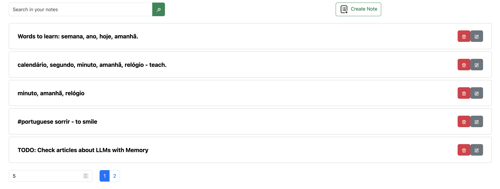
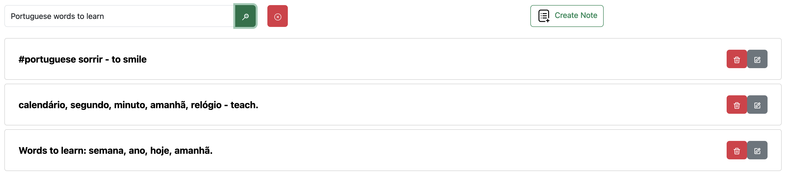
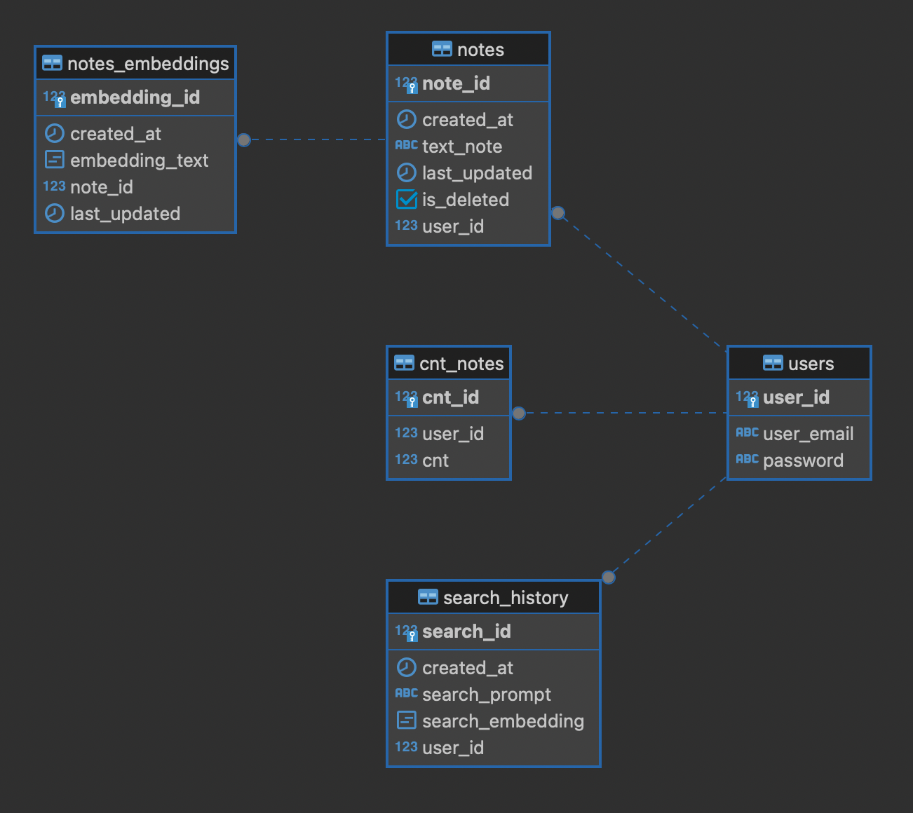

# Are you a good detective?
You can find solution for this task here:
https://drive.google.com/drive/folders/1uL0ctI3X_thT9JgwuT0reic2V0AEN2yA

# Are you a good hacker? 
AINotes - application with a flexible Note Storage and Intuitive Search.

## Tools overview

### Application 
Dash - love it. Dash, a framework developed by Plotly, is well-suited for building custom data-driven applications.



### Search
- **LLM** - GPT

``` 
EMBEDDING_MODEL = "text-embedding-3-small"
GPT_MODEL = "gpt-3.5-turbo" 
```
I tried two implementations: through **embeddings** and through a prompt. I chose the option with embeddings. Reasons: stable result, speed (everything is collected in the database, and then the search is made), reuse and price (fewer requests).


### Datebase
- **DB** - Postgres, published on Heroku
- interaction with DB - sqlalchemy


### Live demo
- DB - published on Heroku
- Application - published on Heroku


https://ai-notes-0f40791934f9.herokuapp.com/

## TODO:
- Embeddings Table. Save model name, that created this embedding.
- Users.
- Add photo to Notes.
